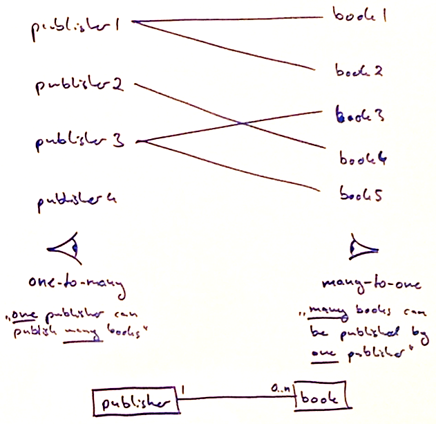

# Model relationships


## Many-To-One
- A model has a many-to-one relationship withe another model if many records of this model can reference the same single
  record of the other model.
- In the database, this is implemented by a foreign key relation (integer field) which holds the id of the referenced
  model.
### Example
```python
from odoo import models, fields

class Book(models.Model):
    _name = "library.book"
    _description = "Book"

    name = fields.Char("Title", required=True)
    publisher_id = fields.Many2one(
        "res.partner",  # comodel name
        "Publisher"  # field label
    )
```
## One-To-Many
- The reverse of a many-to-one relation
- A model has a one-to-many relation to another model if one record of it may reference many other records of the
  referenced model.
- On database level, this relation relies on the inverse many-to-one relation, i. e. in the database there is no
  relation stored in the records of the model with the one-to-many relation.
  Because of this, for every one-to-many relationship in a model there has to be a many-to-one relation defined it the
  corresponding comodel.

### Example
```python
from odoo import fields, models

class Partner(models.Model):
    _inherit = "res.partner"

    published_book_ids = fields.One2many(
        "library.book",  # comodel name
        "publisher_id",  # field name of the many-to-one relation in the comodel
        string="Published Books"  # field name
    )
```

## Many-To-Many
- For models which can both reference multiple records of the other model
- On database level there is a separate table created for every many-to-many relation by concatenating the model names
  and suffixing it with "_rel", e. g. `library_book_res_partner_rel`.

### Example
*models/library_book.py*
```python
class Book(models.Model)
    _name = "library.book"

    author_ids = fields.Many2many(
        "res.partner",  # comodel name
        string="Authors"  # field name
    )
```

*models/res_partner.py*
```python
class Partner(models.Model):
    _inherit = "res.partner"

    book_ids = fields.Many2many(
        "library.book",  # comodel name
        string="Authored Books"  # field name
    )
```

```
+--------------+  0..n       1..n  +-------------+
| library_book |-------------------| res.partner |
+--------------+                   +-------------+

library_book_res_partner_rel:
  - author_id
  - book_id
```
